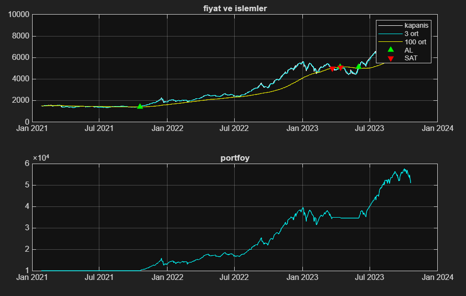
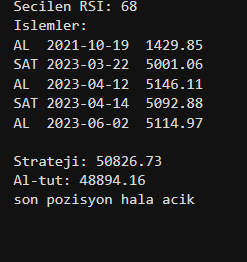

# BIST 100 MATLAB Al-Sat Projesi

MATLAB ile yazilmis, BIST 100 endeksi uzerinde hareketli ortalama ve RSI tabanli basit bir al-sat backtest projesidir.

## Proje Mantigi

Projede iki farkli veri seti kullanilmistir. Eski BIST 100 verisi egitim verisi olarak kullanilip en iyi RSI siniri secilmistir. Secilen sinir daha sonra ayri bir test verisi uzerinde denenip al-tut yontemiyle karsilastirilmistir.

### Strateji

- **Kisa ortalama:** 3 gunluk hareketli ortalama
- **Uzun ortalama:** 100 gunluk hareketli ortalama
- Kisa ortalama uzun ortalamanin **ustune cikarsa** AL sinyali olusur
- Kisa ortalama uzun ortalamanin **altina inerse** SAT sinyali olusur
- RSI filtresi: RSI secilen sinirin **ustundeyse** yeni alim yapilmaz

### Egitim

`rsi.m` fonksiyonu egitim verisi uzerinde 68 ile 80 arasindaki RSI sinirlarini dener ve en iyi sonucu veren degeri secer.

## Sonuc





```
Secilen RSI: 68
Strateji: 50826.73
Al-tut:   48894.16
```

Baslangic sermayesi 10.000 TL ile strateji, al-tut yontemini gecmistir.

## Dosyalar

```
bist100-matlab-ml-scalp/
├── main.m               # ana kod
├── rsi.m                # rsi hesaplama ve sinir secimi
├── grafik.png           # fiyat ve islem grafigi
├── sonuc.png            # islem ozeti ekran goruntusu
├── islemler.txt         # program calisinca olusturulan islem ozeti
└── data/
    ├── egitim_verisi.csv
    └── test_verisi.csv
```

## Veri Kaynaklari

- **Egitim verisi:** [Kaggle — BIST100 Turkish Stock Market Dataset](https://www.kaggle.com/datasets/umar47/bist100-turkish-stock-market-dataset?resource=download)
- **Test verisi:** [github.com/zakcali/pandas-ta2numba](https://raw.githubusercontent.com/zakcali/pandas-ta2numba/main/XU100-1D.csv)

## Calistirma

MATLAB'da proje klasorunu ac ve su komutu yaz:

```matlab
main
```

Program calisinca:
- Egitim verisinden en iyi RSI siniri secilir
- Test verisinde al-sat islemi yapilir
- Grafik gosterilir
- `islemler.txt` dosyasi olusturulur
